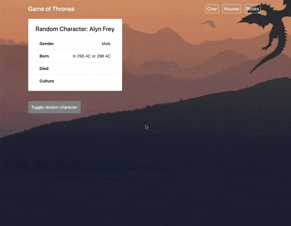

Стэк технологий: JavaScript , Framework: React .
# Второй проект по курсу "Полный курс по Javascript + React"
## Автор курса: Иван Петриченко

### Описание изученного материала:
1. Fetch API.
2. Жизненный цикл компонентов.
3. Паттерны React.
4. Навигация в приложении с помощью React Router.
5. Паттерн HOC (Higher Order Component).
6. Хуки React.

**В этом репозитории второй проект второй части курса.**

[Первая часть курса](https://github.com/winesf/JavaScript)

#### Проект "Api Game of Thrones" 

Функционал приложения:
* Вывод информации https://anapioficeandfire.com/

